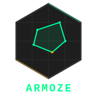

# ARMOZE

  
   
  <b>Arma Reforger Map Overlay Zone Editor</b>
   
  <i>The ultimate visual tool for designing, managing, and exporting map zones.</i>

 

  

## Overview

**ARMOZE** is a powerful web-based application designed to streamline the workflow for Arma Reforger modders and server owners. Instead of manually guessing coordinates or writing tedious scripts, you can visually draw your zones on top of your map image and export them directly into game-ready formats.

Whether you need a simple **Safe Zone**, a complex **PvP Area**, or a custom **Objective Trigger**, this tool handles the math for you.

## Key Features

### Visual Design Tools
*   **Geometric Shapes**: Quickly place Circles and Rectangles for standard zones.
*   **Pen Tool**: Create complex, organic, or strictly defined polygonal zones.
    *   *Features*: Loop closing, point manipulation, and visual feedback.
*   **Grid Snapping**: toggleable grid system to simpler alignment (Hotkey: `S`).
*   **Freehand Drawing**: For rough sketching or natural boundaries.

### Powerful Exports
*   **Workbench Plugin (`.c`)**:
    *   Generates a custom plugin script for the **Arma Reforger Workbench**.
    *   Run the plugin to **automatically spawn Trigger Entities** in your World Editor with correct shapes, sizes, and names.
*   **Game Mode Component (`.c`)**:
    *   Exports a drop-in `SCR_ZoneManagerComponent` class.
    *   Attach to your Game Mode entity for immediate script-based access to zone data.
*   **Map Overlays**:
    *   Export high-quality **TIFF** images to use as in-game map textures or UI overlays.
*   **Project Files**:
    *   Save your entire session to `.json` and reload it anytime for collaboration or future edits.

## Workflow Guide

### 1. Visualizing
1.  Export your map from Reforger (or use a satellite image).
2.  Drag & drop the image into the editor.
3.  Use the toolbar to select your zone types (Safe, Restricted, PvP, etc.).
4.  Draw your zones.

### 2. Exporting to World Editor (Recommended)
1.  Click **Export** -> **Workbench Plugin**.
2.  Save the `.c` file to your mod's `scripts/WorkbenchGame/WorldEditor` folder.
3.  In the Reforger World Editor, press `Ctrl + Shift + I`.
4.  *Magic!* Your zones appear as real entities in the world.

## Shortcuts

| Action | Shortcut |
| :--- | :--- |
| **Select Tool** | `V` |
| **Rectangle** | `R` |
| **Circle** | `C` |
| **Line** | `L` |
| **Pen Tool** | `P` |
| **Freehand** | `D` |
| **Grid Snap** | `S` |
| **Fit View** | `F` |
| **Zoom In/Out** | `+` / `-` |
| **Undo** | `Ctrl + Z` |
| **Redo** | `Ctrl + Y` or `Ctrl + Shift + Z` |
| **Copy Zone** | `Ctrl + C` |
| **Paste Zone** | `Ctrl + V` |
| **Duplicate Zone** | `Ctrl + D` |
| **Delete Zone** | `Delete` or `Backspace` |
| **Export** | `Ctrl + E` |

## Installation / Usage

1.  Clone this repository.
2.  Open `index.html` in any modern web browser.
3.  *Optional*: Serve with a local web server (e.g., Live Server) for the best experience.

---

*Designed for the Arma Reforger Community.*
